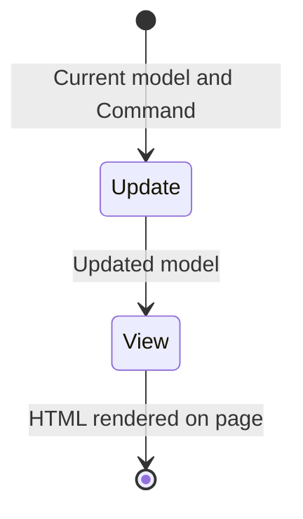
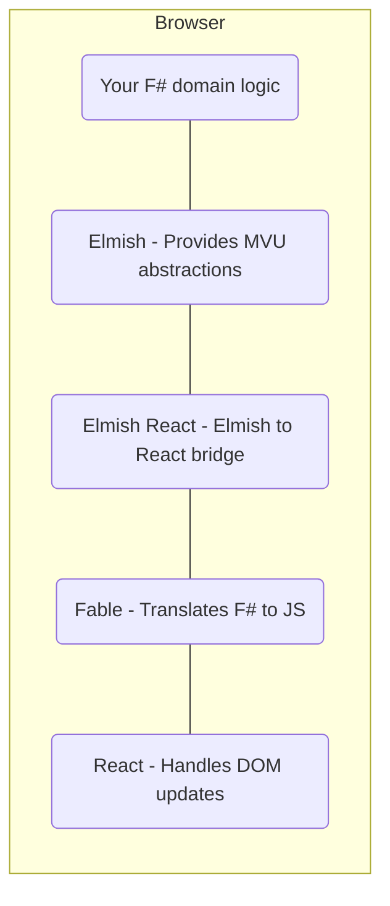

# [Elmish](https://elmish.github.io/elmish) in SAFE

## What is Elmish?

Elmish is a library for building single page applications in F# applications in following the [model-view-update](https://guide.elm-lang.org/architecture/) architecture made famous by [Elm](http://elm-lang.org).

> The following diagram is a simplified, high-level view of the MVU pattern. `Model` in this case refers to your application's state, with `Update` and `View` the two functions that handle the flow of messaging. If you wish to read more, we also recommend reading the excellent [Elmish Book](https://zaid-ajaj.github.io/the-elmish-book/#/chapters/elm/the-architecture).

## How does Elmish integrate with SAFE?
Elmish is the library used to build the front-end application in SAFE and that application is compiled to Javascript by [Fable](component-fable.md) to run in the browser. The [SAFE Stack template](template-overview.md) comes pre-bundled with the [Elmish React](https://elmish.github.io/react/) module, which (as the name suggests) uses the [React](https://reactjs.org/) library to handle the heavy lifting of modifyng the DOM in an efficient way. This allow us to use the pure functional style of the MVU pattern whilst still retaining the ability to have a highly performant user interface.

Because Elmish works alongside React, it is possible to use the vast number of available React components from the Javascript ecosystem within our Elmish applications.

This conceptual diagram illustrates how the different pieces of Elmish, React and Fable fit together to make the front-end part of your SAFE application which runs in the browser.

## Learn Elmish

 - The official [Elmish docs](https://elmish.github.io/elmish/)
 - [The Elmish Book](https://zaid-ajaj.github.io/the-elmish-book)
