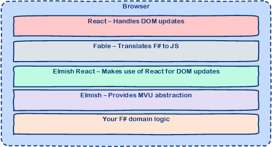

# [Elmish](https://elmish.github.io/elmish/) in SAFE

## What is Elmish?

Elmish is a set of simple abstractions for writing user interfaces in F# applications in a functional style following the [model-view-update](https://www.elm-tutorial.org/en/02-elm-arch/cover.html) architecture made famous by [Elm](http://elm-lang.org/). The Elmish library is not coupled to any specific view engine, but is intended for use in conjuction with a DOM/renderer such as React/ReactNative or VirtualDOM.

## How does Elmish integrate with SAFE?
Elmish provides the ability to more easily create user interfaces in the browser on top of [Fable](component-fable.md) so that you don't have to write applications that are tightly coupled to HTML using e.g. JQuery or similar. The [SAFE Stack template](template-overview.md) comes pre-bundled with the [Elmish React](https://elmish.github.io/react/) module, which (as the name suggests) uses the [React](https://reactjs.org/) library to handle the heavy lifting of modifyng the DOM in an efficient way. This allow us to use the pure functional style of the MVU pattern whilst still retaining the ability to have a highly performant user interface.

This conceptual diagram illustrates how your F# is run in the browser in a SAFE app.

Learn more about Elmish [here](https://elmish.github.io/elmish/).
