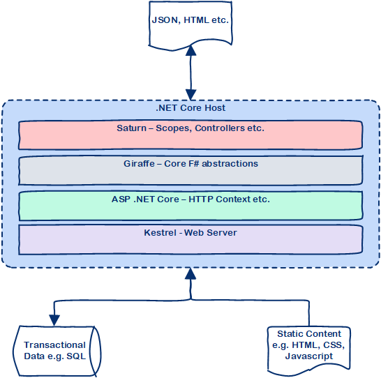

# [Saturn](https://saturnframework.github.io/docs/) in SAFE
Saturn is a web development library written in F# which allows you to easily create both server-side MVC applications as well as web APIs. It runs on top of two other components:

* [Giraffe](https://github.com/dustinmoris/Giraffe), an F#-specific library for writing functional-first web applications.
* Microsoft's [ASP .NET Core](https://www.asp.net/core/overview/aspnet-vnext).

Saturn, via Giraffe, provides very good integration with other ASP.NET Core components such as authentication.

Many of Saturn's components and concepts will seem familiar to those of us with experience of other web frameworks such as Ruby on Rails, Python’s Django or especially Elixir's [Phoenix](http://phoenixframework.org/).

## How does Saturn integrate with SAFE?
Saturn provides the ability to drive your SAFE applications from the server. It enables:

* Routing and hosting of your server-side APIs through a set of simple-to-use abstractions.
* Hosting of your client-side assets, such as HTML, CSS and JavaScript generated by Fable.
* Other cross cutting concerns e.g. authentication etc.

It also integrates with SAFE to allow seamless sharing of types and functions, since Fable will convert most F# into JavaScript. In addition, you can seamless transport data between client and server using either the Fable.JSON or Fable.Remoting libraries, both of which have support for Saturn. You can read more about this [here](feature-clientserver.md).

Learn more about Saturn [here](https://saturnframework.github.io/docs/).