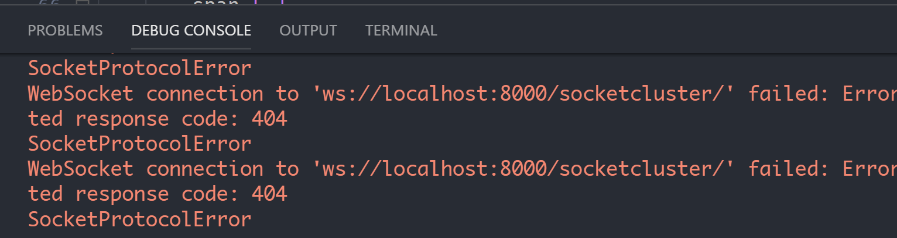
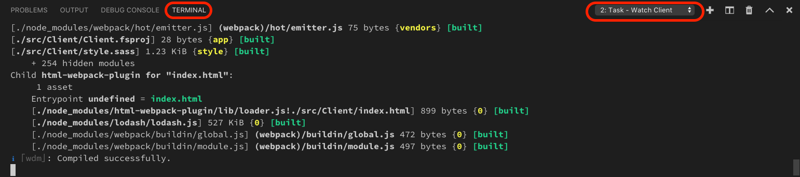

### Run error due to node/npm version

You may receive an error when trying to run the app, e.g. the current version might require `{"node":"~18 || ~20","npm":"~9 || ~10"}` but your locally installed versions are different. Ideally we'd like to install different versions side-by-side, which we can do using [Node Version Manager](https://www.freecodecamp.org/news/node-version-manager-nvm-install-guide/).

Once NVM is installed, identify the version of Node that you'd like to install by checking this [matrix](https://nodejs.org/en/download/releases). For our example here we can identify version `20.10.0` as satifying both the Node and npm version requirements. To install this version for the current project run:

```
nvm install 20.10.0
nvm use 20.10.0
```

The output from these commands will also tell you which version of npm is linked to the Node version, but if you do not currently have that version of npm installed you need to install it manually with the command:

```
npm install -g npm@10.2.4
```

The version numbers may vary depending on the SAFE Stack version you are using.

You should now be able to run the app successfully.

### SocketProtocolError in Debug Console

You may see the following `SocketProtocolError` message in the Debug Console once you have started your SAFE application.

> `WebSocket connection to 'ws://localhost:8000/socketcluster/' failed: Error during WebSocket handshake: Unexpected response code: 404`

<center></center>

Whilst these messages can be safely ignored, you can eliminate them by installing **Redux Dev Tools** in the launched Chrome instance as described in the debugging [prerequisites](../recipes/developing-and-testing/debug-safe-app/#0-install-prerequisites) section.

### Node Process does not stop after stopping the VS Code debugger
VS Code does not kill the Fable process when you stop the debugger, leaving it running as a "zombie". In such a case, you will have to explicitly kill the process otherwise it will hold onto
port 8080 and prevent you starting new instances. This should be easily doable by sending Ctrl+C in the Terminal window in VS Code for `Watch Client` task. Tracked [here](https://github.com/SAFE-Stack/SAFE-template/issues/191).

<center></center>

### Chrome opens to a blank window when debugging in VS Code

* Occasionally, VS Code will open Chrome before the Client has started. In this case, you will be presented with a blank screen until the client starts.
* Depending on the order in which compilation occurs, VS Code may launch the web browser before the server has started. If this occurs, you may need to refresh the browser once the server is fully initialised.

### JavaScript bundle size

A project created from SAFE template might issue the following warning from Webpack upon building the JavaScript bundle:

```
WARNING in entrypoint size limit: The following entrypoint(s) combined asset size exceeds the recommended limit (244 KiB). This can impact web performance.
```

We're striving to optimise the bundle size, however with a number of different options and dependencies it's not that easy to stay below the Webpack recommended limit.

To minimize the bundle size in your project you can try restricting browser compatibility by modifying the [Babel Preset targets for Browserslist](https://babeljs.io/docs/en/babel-preset-env#targets) and thus using less polyfills.

For more info, see this [issue](https://github.com/SAFE-Stack/SAFE-template/issues/185).

### Server port change

The port that the server runs on changed from 8085 to 5000 (the ASP.NET Core default) in v4 of the SAFE Template. This was to make it compatible with deployment to Azure App Service on Linux.
