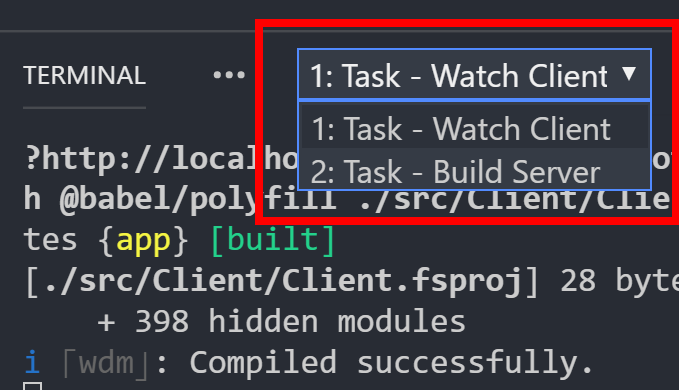

A powerful features of the SAFE Stack is that it supports combined client / server debugging in F#. This means that you can use a single IDE (in this case, [Visual Studio Code](https://code.visualstudio.com/)) to debug *both client and server code* in the **same IDE session**.

As of v0.38 of the SAFE Template, new SAFE applications come pre-configured with build, launch and debugging support in VS Code.

## Prerequisites
1. **Install [Google Chrome](https://www.google.com/chrome/)**: Enables for client-side debugging.
1. **Install the [Redux Dev Tools](https://chrome.google.com/webstore/detail/redux-devtools/lmhkpmbekcpmknklioeibfkpmmfibljd?hl=en)** extension for Chrome: Provides improved debugging support in Chrome with Elmish.
1. **Configure VS Code** with the following extensions:
    * [Ionide](https://marketplace.visualstudio.com/items?itemName=Ionide.Ionide-fsharp): Provides F# support to Code.
    * [C#](https://marketplace.visualstudio.com/items?itemName=ms-vscode.csharp): Provides .NET Core debugging support.
    * [Debugger for Chrome](https://marketplace.visualstudio.com/items?itemName=msjsdiag.debugger-for-chrome): Provides integrated client-side debugging in Code.

## Launching and debugging a SAFE application in VS Code
The SAFE template allows you to launch a SAFE Stack application with both client and server debugging enabled automatically.

1. Create a new SAFE application using the [SAFE template](template-overview)
1. Open VS Code in the folder containing your application
1. Go to the Debug pane (`CTRL + Shift + D`)
 
    

1. Ensure that **Debug SAFE App** is selected as the launch configuration
1. Hit `F5` to launch the application, or hit the green play button in the launch configuration panel

That's it. VS Code will now automatically:

* Download all dependencies for both client and server
* Build both the client and server
* Start both client and server
* Attach debuggers for both the client and server simultaneously!

## The VS Code debugger
This section explains the basics of debugging SAFE applications with VS Code. Refer to [here](https://code.visualstudio.com/docs/editor/debugging) to learn more about the VS Code debugger.

### VS Code Tooling basics
Once you start debugging a SAFE app, in the Terminal pane two Tasks will begin in parallel:

* **Watch Client**: Builds and runs the client in hot module reload mode
* **Build Server**: Builds and runs the server

    

Low-level output from the command line of both client and server can be seen in the appropriate Terminal window. Observe that the floating Debug control contains two active debugging sessions:

* **Debug Client**: Selects the Client debug session
* **Debug Server**: Selects the Server debug session

    

Selecting one or the other will instruct the Debug pane to show details for that "side" of the application e.g. breakpoints, call stack etc.

### Setting breakpoints
To set a breakpoint, simply highlight the line of code that you wish to stop on and hit `F9`, or click on the left-side gutter of the code window; a red dot will appear to show the breakpoint is set. You can see more on VS Code breakpoints [here](https://code.visualstudio.com/docs/editor/debugging#_breakpoints).

Here you can see a breakpoint that has been hit in the `update` method of the sample application that is bundled with the SAFE template.

### Viewing debug output
Debug output from Chrome will automatically be sent to the integrated Debug Console. This is especially useful for Elmish applications, as you can interrogate message and model updates directly in the IDE.

> Note: If you observe error messages regarding `SocketProtocolError` (see below), you can eliminate them by installing the Redux Dev Tools in the launched Chrome instance, as mentioned earlier. However, these errors can also safely be ignored. 

## Restarting your application
In the standard launch mode seen above, hot module reloading is enabled on the client, so changes that are made to your Fable application will occur immediately.

However, in order to support debugging, watch mode is not enabled on the server; server changes require a restart of the server debugging session: Having ensured that Debug Server is selected in the floating Debug control, select the Restart icon or hit `CTRL + SHIFT + F5`. The server will stop, rebuild and restart with the debugger automatically re-attached.

## Advanced options
The SAFE template comes with several other modes of operation for debugging:

### Full watch mode
You can elect to use "watch" mode on both client *and* server by choosing the **Watch SAFE app** option from the Debug Launcher. Here, changes to any server file will automatically initiate a restart of it. However, whilst you will still be able to debug the client, in this mode there is no capability for server-side debugging.

### Debug Server or Client only
You can elect to launch and debug only the client or server in isolation. This may be useful if you are running the other component separately e.g. through FAKE, the `dotnet` command line tool directly or via Visual Studio. You can initiate this by choosing either **Debug Client** or **Debug Server** as required.

### Build Server
You can initiate a restore and rebuild of the server by hitting `CTRL + SHIFT + B` and selecting **Build Server** from the drop-down.