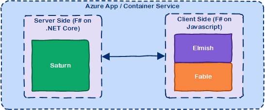

## SAFE Stack components

The SAFE acronym is made up of four separate components:

* [**S**aturn](#saturn) for back-end services in F#
* [**A**zure](#microsoft-azure) as a hosting platform plus associated platform services
* [**F**able](#fable) for running F# in the web browser
* [**E**lmish](#elmish) for client-side user interfaces

### [Saturn](safe-saturn.md)
The Saturn library builds on top of the solid foundation of both the F#-friendly [Giraffe](https://github.com/giraffe-fsharp/Giraffe) and the high performance, rock-solid [ASP .NET Core](https://docs.microsoft.com/en-us/aspnet/core/?view=aspnetcore-2.1) web server to provide a set of optional abstractions which make configuring web applications and constructing complex routes extremely easy to achieve.

Saturn can host RESTful API endpoints, drive static websites or server-generated content, all inside an easy-to-learn functional programming model.

### [Microsoft Azure](safe-azure.md)
Azure is a comprehensive set of cloud services that developers and IT professionals use to build, deploy and manage applications through a global network of data centres. Integrated tools, DevOps and a marketplace support you in efficiently building anything from simple mobile apps to Internet-scale solutions.

### [Fable](safe-fable.md)
Fable is an F# to JavaScript compiler powered by Babel, designed to produce readable and standard code. Fable allows you to create applications for the browser written entirely in F#, whilst also allowing you to interact with native Javascript as needed.

### [Elmish](safe-elmish.md)
The Elmish model allows you to construct user interfaces running in the browser using a functional programming model. Modelled on the Elm application model, Elmish uses the Model-View-Update paradigm to allow you to write applications that are simple to reason about. Elmish sits on top of the [React](https://reactjs.org/) framework.

## Further reading

Please also feel free to read this [blog series](https://compositional-it.com/blog/2017/09-22-safe-release/index.html) on the Compositional IT website for more details on the history of SAFE.

## Are there alternative components in the SAFE stack?
Yes, absolutely. The above components are what we recommended as the default SAFE stack, but you can of course replace the components with alternatives as you see fit. Here are some examples:

* [Suave](https://suave.io/) is a complete web server and programming model designed for F# that is similar to that of Giraffe.
* [Freya](https://freya.io/) is an alternative F#-first web stack which has a pluggable runtime model which allows it to be hosted in a variety of web servers including ASP .NET Core.
* [AWS](https://aws.amazon.com/) is Amazon's cloud compute offering, providing a large number of services available globally.
* [WebSharper](http://websharper.com/) is a complete end-to-end programming stack, comprising both server- and client-side components. It supports both F# and C# programming models.