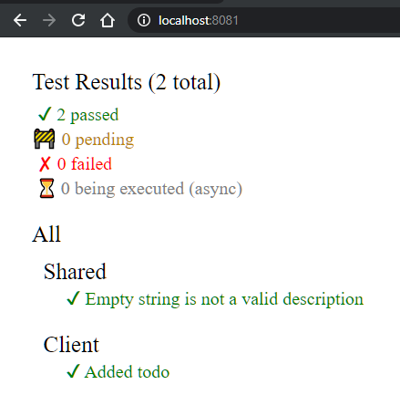

# How do I test the client?

Testing on the client is a little different than on the server.

This is because the code which is ultimately being executed in the browser is Javascript, translated from F# by Fable, and so it must be tested in a Javascript environment.

Furthermore, code that is shared between the Client and Server must be tested in both a dotnet environment _and_ a Javascript environment.

The SAFE template uses a library called Fable.Mocha which allows us to run the same tests in both environments. It mirrors the Expecto API and works in much the same way.

## **I'm using the standard template**
****
If you are using the standard template then there is nothing more you need to do in order to start testing your Client.

In the tests/Client folder, there is a project named **Client.Tests** with a single script demonstrating how to use Mocha to test the TODO sample.

>Note the compiler directive here which makes sure that the Shared tests are only included when executing in a Javascript (Fable) context. They are covered by Expecto under dotnet as you can see in **Server.Tests.fs**.

#### 1. Launch the test server

In order to run the tests, instead of starting your application using
```powershell
dotnet run
```
you should instead use
```powershell
dotnet run Runtests
```

#### 2. View the results

Once the build is complete and the website is running, navigate to `http://localhost:8081/` in a web browser. You should see a test results page that looks like this:



> This command builds and runs the Server test project too. If you want to run the Client tests alone, you can simply launch the test server using `npm run test:live`, which executes a command stored in `package.json`.

## **I'm using the minimal template**

If you are using the minimal template, you will need to first configure a test project as none are included.

#### 1. Add a test project
In the tests/Client folder, create a create a **.Net** library called **Client.Tests**.

```powershell
dotnet new ClassLib -lang F# -n Client.Tests -o tests/Client
dotnet sln add tests/Client
```

#### 2. Reference the Client project
Reference the Client project from the Client.Tests project:

```powershell
dotnet add src/Client.Tests reference src/Client
```

#### 3. Add the Fable.Mocha package to Test project
Run the following command:

```powershell
dotnet add tests/Client package Fable.Mocha
```

#### 4. Add something to test

Add this function to Client.fs in the Client project

```fsharp
let sayHello name = $"Hello {name}"
```

#### 5. Add a test
Replace the contents of `tests/Client/Library.fs` with the following code:

```fsharp
module Tests

open Fable.Mocha

let client = testList "Client" [
    testCase "Hello received" <| fun _ ->
        let hello = Client.sayHello "SAFE V3"

        Expect.equal hello "Hello SAFE V3" "Unexpected greeting"
]

let all =
    testList "All"
        [
            client
        ]

[<EntryPoint>]
let main _ = Mocha.runTests all
```

#### 6. Add Test web page

Add a file called **index.html** to the tests/Client folder with following contents:
```html
<!DOCTYPE html>
<html>
    <head>
        <title>SAFE Client Tests</title>
    </head>
    <body>
    </body>
</html>
```

#### 7. Add test webpack config

Add a file called **webpack.tests.config.js** to the root directory with the following contents:****

```js
// Template for webpack.config.js in Fable projects
// Find latest version in https://github.com/fable-compiler/webpack-config-template

// In most cases, you'll only need to edit the CONFIG object (after dependencies)
// See below if you need better fine-tuning of Webpack options

// Dependencies. Also required: core-js, @babel/core,
// @babel/preset-env, babel-loader, sass, sass-loader, css-loader, style-loader, file-loader, resolve-url-loader
var path = require('path');
var webpack = require('webpack');
var HtmlWebpackPlugin = require('html-webpack-plugin');
var CopyWebpackPlugin = require('copy-webpack-plugin');

var CONFIG = {
    // The tags to include the generated JS and CSS will be automatically injected in the HTML template
    // See https://github.com/jantimon/html-webpack-plugin
    indexHtmlTemplate: 'tests/Client/index.html',
    fsharpEntry: 'tests/Client/Library.fs.js',
    outputDir: 'tests/Client',
    assetsDir: 'tests/Client',
    devServerPort: 8081,
    // When using webpack-dev-server, you may need to redirect some calls
    // to a external API server. See https://webpack.js.org/configuration/dev-server/#devserver-proxy
    devServerProxy: undefined,
    babel: undefined
}

// If we're running the webpack-dev-server, assume we're in development mode
var isProduction = !process.argv.find(v => v.indexOf('webpack-dev-server') !== -1);
var environment = isProduction ? 'production' : 'development';
process.env.NODE_ENV = environment;
console.log('Bundling for ' + environment + '...');

// The HtmlWebpackPlugin allows us to use a template for the index.html page
// and automatically injects <script> or <link> tags for generated bundles.
var commonPlugins = [
    new HtmlWebpackPlugin({
        filename: 'index.html',
        template: resolve(CONFIG.indexHtmlTemplate)
    })
];

module.exports = {
    // In development, split the JavaScript and CSS files in order to
    // have a faster HMR support. In production bundle styles together
    // with the code because the MiniCssExtractPlugin will extract the
    // CSS in a separate files.
    entry: {
        app: resolve(CONFIG.fsharpEntry)
    },
    // Add a hash to the output file name in production
    // to prevent browser caching if code changes
    output: {
        path: resolve(CONFIG.outputDir),
        filename: isProduction ? '[name].[hash].js' : '[name].js'
    },
    mode: isProduction ? 'production' : 'development',
    devtool: isProduction ? 'source-map' : 'eval-source-map',
    optimization: {
        splitChunks: {
            chunks: 'all'
        },
    },
    // Besides the HtmlPlugin, we use the following plugins:
    // PRODUCTION
    //      - MiniCssExtractPlugin: Extracts CSS from bundle to a different file
    //          To minify CSS, see https://github.com/webpack-contrib/mini-css-extract-plugin#minimizing-for-production
    //      - CopyWebpackPlugin: Copies static assets to output directory
    // DEVELOPMENT
    //      - HotModuleReplacementPlugin: Enables hot reloading when code changes without refreshing
    plugins: isProduction ?
        commonPlugins.concat([
            new CopyWebpackPlugin({ patterns: [{ from: resolve(CONFIG.assetsDir) }] }),
        ])
        : commonPlugins.concat([
            new webpack.HotModuleReplacementPlugin(),
        ]),
    resolve: {
        // See https://github.com/fable-compiler/Fable/issues/1490
        symlinks: false
    },
    // Configuration for webpack-dev-server
    devServer: {
        publicPath: '/',
        contentBase: resolve(CONFIG.assetsDir),
        host: '0.0.0.0',
        port: CONFIG.devServerPort,
        proxy: CONFIG.devServerProxy,
        hot: true,
        inline: true
    },
    module: {
        rules: [
           
        ]
    }
};

function resolve(filePath) {
    return path.isAbsolute(filePath) ? filePath : path.join(__dirname, filePath);
}
```

#### 8. Install the client's dependencies

```powershell
npm install
```

#### 9. Launch the test website

```powershell
dotnet fable watch src/Client --run webpack-dev-server --config webpack.tests.config
```


Once the build is complete and the website is running, navigate to `http://localhost:8081/` in a web browser. You should see a test results page that looks like this:


