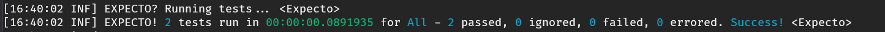
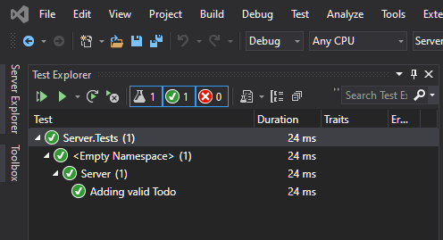

# How do I test the Server?

Testing your Server application in a SAFE app is just the same as in any other dotnet app, and you can use the same tools and frameworks that you are familiar with.

This includes all of the usual suspects such as [NUnit](https://nunit.org/), [XUnit](https://xunit.net/), [FSUnit](https://fsprojects.github.io/FsUnit/), [Expecto](https://github.com/haf/expecto), [FSCheck](https://fscheck.github.io/FsCheck/), [AutoFixture](https://github.com/AutoFixture/AutoFixture) etc.

In this guide we will look at using Expecto, as this is included with the standard SAFE template.

## **I'm using the standard template**

### Using the Expecto runner

If you are using the standard template then there is nothing more you need to do in order to get started testing your Server.

You will find a folder in the solution named **tests**. Inside this there is a project, **Server.Tests**, which contains a single script demonstrating how to use Expecto to test the TODO sample.

In order to run the tests, instead of starting your application using
```powershell
dotnet fake build -t run
```
you should instead use
```powershell
dotnet fake build -t runtests
```
This will execute the tests and print the results into the console window.



> This method builds and runs the Client test project too, which can be slow. If you want to run the Server tests alone, you can simply navigate to the Server.Tests directory and execute the project using `dotnet run`.

### Using dotnet test or the Visual Studio Test runner 

If you would like to use dotnet test from the command line or the test runner that comes with Visual Studio, there are a couple of extra steps to follow.

####1. Install the Test Adapters

Run the following commands at the root of your solution:
```powershell
dotnet paket add Microsoft.NET.Test.Sdk -p Server.Tests
```
```powershell
dotnet paket add YoloDev.Expecto.TestSdk -p Server.Tests
```

####2. Disable EntryPoint generation

Open your ServerTests.fsproj file and add the following element:

```xml
<PropertyGroup>
    <GenerateProgramFile>false</GenerateProgramFile>
</PropertyGroup>
```

####2. Discover tests

To allow your tests to be discovered, you will need to decorate them with a `[<Tests>]` attribute.

The provided test would look like this:
```fsharp
[<Tests>]
let server = testList "Server" [
    testCase "Adding valid Todo" <| fun _ ->
        let storage = Storage()
        let validTodo = Todo.create "TODO"
        let expectedResult = Ok ()

        let result = storage.AddTodo validTodo

        Expect.equal result expectedResult "Result should be ok"
        Expect.contains (storage.GetTodos()) validTodo "Storage should contain new todo"
]
```

####3. Run tests

There are now two ways to run these tests.

From the command line, you can just run
```powershell
dotnet test
```
from the root of your solution.

Alternatively, if you are using Visual Studio or VS Mac you can make use of the built-in test explorers.



## **I'm using the minimal template**

If you are using the minimal template, you will need to first configure a test project as none are included.

####1. Add a test project

At the root level of your solution, create a create a **.Net Core** console app called **Server.Tests** and then delete the Program.fs module that it comes with.

####2. Reference the Server project

Add a reference from the Server.Tests project to the Server project.


####3. Add Expecto

Navigate to the directory of the project that you just created and run the following command:

```powershell
dotnet add package Expecto
```

You will see a warning that a Program.fs file might be generated which will need deleting, so do that if necessary.

You can prevent this reoccuring by adding an entry to your test project file:

```xml
<PropertyGroup>
    <GenerateProgramFile>false</GenerateProgramFile>
</PropertyGroup>
```

####4. Add something to test

Update the Server.fs file in the Server project to extract the message logic from the router like so:
```fsharp
let getMessage () = "Hello from SAFE!"

let webApp =
    router {
        get Route.hello (getMessage () |> json )
    }
```

####5. Add a test

Add a module called Server.Tests.fs to your test project. Add the following code to the module:
``` fsharp
module Server.Tests

open Expecto

let server = testList "Server" [
    testCase "Message returned correctly" <| fun _ ->
        let expectedResult = "Hello from SAFE!"        
        let result = Server.getMessage()
        Expect.equal result expectedResult "Result should be ok"
]

[<EntryPoint>]
let main _ = runTests defaultConfig server
```

####6. Run the test

Navigate to the Test project directory and execute it using
```powershell
dotnet run
```

This will print out the results in the console window


####7. Using dotnet test or the Visual Studio Test Explorer

Navigate to the Test project directory and add the test runners using the following commands:

```powershell
dotnet add package Microsoft.NET.Test.Sdk
```
and
```powershell
dotnet add package YoloDev.Expecto.TestSdk
```

You can now add `[<Test>]` attributes to your tests to allow them to be discovered and run them using the dotnet tooling in the same way as explained earlier for the standard template.