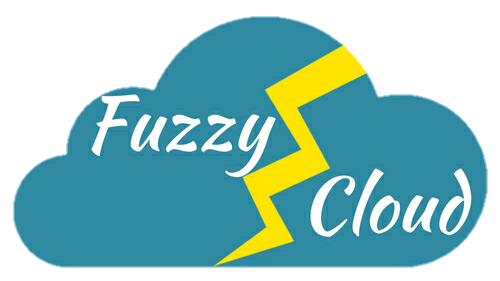

The following companies provide commercial training, support, consultancy and development services for SAFE Stack applications.

## [Compositional IT](https://compositional-it.com/)

Compositional IT are experts in designing functional-first, cloud-ready systems, offering consultancy and support, training and development. Run by an F# MVP and well-known member of the .NET community, they are dedicated to raising awareness of the benefits of both functional programming and harnessing the power of the cloud to deliver high-quality, low-cost solutions.

## [Lambda Factory](http://lambdafactory.io/)

Lambda Factory is a consulting company specializing in designing and building complex systems using Functional Programming languages such as F#, Elm and Elixir. It also offers help with introducing functional programming and open source driven development to the organization, as well as trainings, workshops and mentoring. Founded by open source contributor and well-known member of F# Community, Lambda Factory has been committed to supporting F# Community and helping it grow.

## [Fuzzy Cloud](https://fuzzycloud.in/)

Fuzzy Cloud is a fast-growing team of highly skilled and passionate IT professionals who can deliver services that help you speed up innovation and maximize efficiency. Our services are dynamic, scalable, resilient and responsive enabling rapid growth and high value for our clients. We take a highly collaborative approach to align our services with your business goals. We provide consulting in area like Cloud, Cross Platform mobile development, Machine Learning etc using Languages like F#, Python, Dart and few others.

## The F# Community
The SAFE stack was written largely by the community as open source projects, such as Saturn, Giraffe, Fable and Elmish (as well as the alternative elements within the stack). All those teams are always happy to contribute and help out.

## Social
You can also reach out to the SAFE team on [@safe_stack](https://twitter.com/safe_stack) or on the regular F# channels on Slack: either the official [F# Foundation Slack](https://fsharp.slack.com/messages/C04C6V0JH/?) or on the [Functional Programming Slack](https://functionalprogramming.slack.com/messages/C045LHLTH/). We'll be expanding this over time. 
