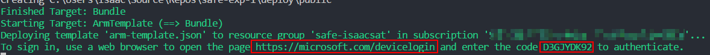
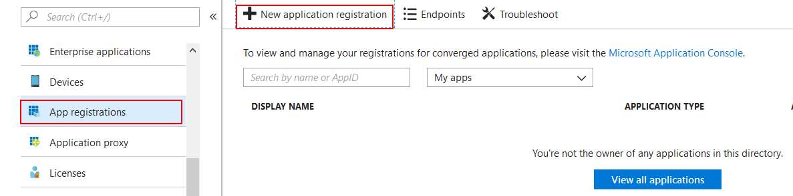
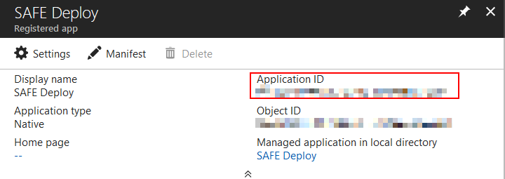

The SAFE template has the ability to deploy to Azure's [App Service](https://azure.microsoft.com/en-us/services/app-service/) with minimum effort. This template mode will also create you an [Application Insights](https://azure.microsoft.com/en-us/services/application-insights/) account, linked to your web application.

## What is Azure App Service?

The Azure App Service allows you to quickly build, deploy, and scale enterprise-grade web, mobile, and API apps running on any platform whilst meeting rigorous performance, scalability, security and compliance requirements using a fully-managed platform to perform infrastructure maintenance.

It comes in a number of pricing plans, including a free option and has options for scale-up, scale-out, turn-key authentication as well as powerful monitoring capabilities. It is compatible with many runtimes and includes excellent support for both .NET Framework and .NET Core.

## Deployment Steps

In order to deploy your SAFE application to the App Service, **you must first do the following**:

1. Create an [Azure Account](template-azure-registration.md#creating-an-azure-account).
1. Get the [Subscription ID](template-azure-registration.md#selecting-a-subscription) from the account.
1. Create an associated [App Registration](template-azure-registration.md#creating-an-app-registration).

### Custom FAKE build tasks

The Azure variant of the SAFE template adds the following extra build stages:

1. **Bundle** - Runs after the standard Build step. It combines the outputs of the Client and Server application into a single folder.
1. **ArmTemplate** - Deploys an Azure Resource Manager (ARM) template containing an entire environment as required by the SAFE application.
1. **AppService** - Zips up the bundled folder and deploys it into the created environment.

> There is a known issue that currently the FAKE script may sometimes fail the first time you run it with [this error](https://github.com/SAFE-Stack/SAFE-template/pull/65#issuecomment-385619990). If this occurs, simply open the FAKE script in your favourite editor, add a new line anywhere in the script, save and re-run. We're looking to fix this as soon as possible!

### What is an ARM template?

An ARM template is a declarative JSON file which contains the details of the Azure resources you require in your environment. This might include a web application, database, VM and messaging service - essentially any service supported by Azure. ARM templates are smart, in that you can repeatedly deploy them over an existing environment and only the newly added elements in the template will be applied onto the environment - perfect for a CI / CD approach. This also allows you to create entire dev / test environments from scratch within just a few minutes. The ARM template that comes with the SAFE template includes everything you need for a complete deployment to Azure from a clean state.

### Build arguments

Deploying your application through FAKE is relatively simple. Use the following command:
```
fake build --target appservice
    -e subscriptionId=<subId>
    -e clientId=<clientId>
    -e tenantId=<tenantId>
    -e environment=<environment> (optional)
    -e location=<location>       (optional)
    -e pricingTier=<pricingTier> (optional)
```
where:

* `subscriptionId` is an Azure Subscription ID.
* `clientId` is the Application (Client) ID of an Azure App Registration.
* `tenantId` is the Directory (Tenant) ID of an Azure App Registration.
* `environment` is an optional environment name that will be appended to all Azure resources created, which allows you to create entire dev / test environments quickly and easily. This defaults to a random GUID.
* `location` is the Azure data center location you wish to use. There are currently over 30 different data centers worldwide. This defaults to `westeurope`; the full list can be viewed [here](https://blogs.msdn.microsoft.com/uk_faculty_connection/2016/09/19/azure-data-centers-and-regions/). The location must be supplied in lower case and without spaces.
* `pricingTier` is the pricing tier of the app service that hosts your SAFE app. This defaults to F1 (free); the full list can be viewed [here](https://azure.microsoft.com/en-us/pricing/details/app-service/).

Note that you can also modify the FAKE script and embed both the `subscriptionId`, `clientId` and `tenantId` values directly in the script and commit into source control. This is completely safe to do as these values are not sufficient on their own to authenticate into Azure (see below).

### Interactive deployment

When running the build script, you will need to interactively authenticate with Azure in order to deploy the ARM template. During the FAKE script, you will see the following midway through the build cycle:



Navigating to that URL will request you to input the code shown above:


Finally, you will be prompted sign into Azure using your normal user account, and possibly consent to granting permissions to the application. After a short delay, the FAKE script will continue.



> Note: If you're getting `FileNotFoundException` for `Microsoft.Rest.ClientRuntime.Azure`, try editing and rerunning FAKE script ([see details](https://github.com/SAFE-Stack/SAFE-template/pull/65#issuecomment-385621229)).

### Creating a fully automated deployment

You can also elect to implement a fully-automated (non-interactive) deployment model, ideal for Continuous Deployment (CD) scenarios through tools such as AppVeyor and Visual Studio Team Services, using an [Azure Active Directory Application](https://docs.microsoft.com/en-us/azure/azure-resource-manager/resource-group-create-service-principal-portal#create-an-azure-active-directory-application). In this model, in addition to a SubscriptionID and Client ID, you also supply a Tenant ID and an Application Secret into the FAKE script to deploy your ARM resources; these identities should normally be secured and supplied into your FAKE script as arguments rather than committed into source control.

## Viewing the deployed SAFE application

Once the deployment is complete, you can log into the Azure Portal and see your environment being created.

1. Log into the Azure Portal.
1. Navigate to the Resource Groups blade and locate the newly-created group. Its name will be `safe-<environment>` e.g. `safe-helloworld`.
1. Navigate to the App Service entry shown in the group following the convention `safe-<environment>-web`.
1. Hit Browse from the new App Service blade that appears.

1. Your application will be shown in the browser running on a url following the convention `https://safe-<environment>-web.azurewebsites.net/`.

You can also [deploy to a Docker Container](template-docker.md).