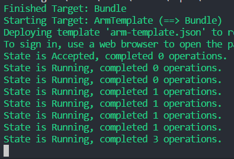

The SAFE template has the ability to deploy to Azure's [App Service](https://azure.microsoft.com/en-us/services/app-service/) with minimum effort.

## What is Azure App Service?
The Azure App Service allows you to quickly build, deploy, and scale enterprise-grade web, mobile, and API apps running on any platform whilst meeting rigorous performance, scalability, security and compliance requirements using a fully-managed platform to perform infrastructure maintenance.

It comes in a number of pricing plans, including a free option and has options for scale-up, scale-out, turn-key authentication as well as powerful monitoring capabilities. It is compatible with virtual any runtime, and includes excellent support for both .NET Framework and Core.

## Deployment Steps
In order to deploy your SAFE application to the App Service, you must have first created an [Azure Account](template-azure-registration/#creating-an-azure-account), selected a [Subscription ID](template-azure-registration/#selecting-the-subscription) and created an associated [App Registration](template-azure-registration/#creating-an-app-registration).

### Custom FAKE build tasks
The Azure variant of the SAFE template adds the following extra build stages:

1. **Bundle** - Runs after the standard Build step. It combines the outputs of the Client and Server application into a single folder.
1. **ArmTemplate** - Deploys an Azure Resource Manager template containing an entire environment as required by the SAFE application.
1. **AppService** - Zips up the bundled folder and deploys it into the created environment.

### Build arguments
Deploying your application through FAKE is relatively simple. Use the following command:
```
    build appservice
        subscriptionId=<subId>
        clientId=<clientId>
        environment=<environment> (optional)
        location=<location>       (optional)
        pricingTier=<pricingTier> (optional)
```
where:

* `subscriptionId` is an Azure Subscription ID.
* `clientId` is the Application ID of an Azure App Registration.
* `environment` is an optional environment name that will be appended to all Azure resources created, which allows you to create entire dev / test environments quickly and easily. This defaults to a random GUID.
* `location` is the Azure data center location you wish to use. There are currently over 30 different data centers worldwide. This defaults to `westeurope`; the full list can be viewed [here](https://blogs.msdn.microsoft.com/uk_faculty_connection/2016/09/19/azure-data-centers-and-regions/). The location must be supplied in lower case and without spaces.
* `pricingTier` is the pricing tier of the app service that hosts your SAFE app. This defaults to F1 (free); the full list can be viewed [here](https://azure.microsoft.com/en-us/pricing/details/app-service/).

### Interactive deployment
When running the build script, you will need to interactively authenticate with Azure in order to deploy the ARM template. During the FAKE script, you will see the following midway through the build cycle:


Navigating to that URL will request you to input the code shown above:


Finally, you will be prompted sign into Azure using your normal user account. After a short delay, the FAKE script will continue.



## Viewing the deployed SAFE application
Once the deployment is complete, you can log into the Azure Portal and see your environment being created.

1. Log into the Azure Portal.
1. Navigate to the Resource Groups blade and locate the newly-created group. It's name will be `safe-<environment>` e.g. `safe-helloworld`.
1. Navigate to the App Service entry shown in the group following the convention `safe-<environment>-web`.
1. Hit Browse from the new App Service blade that appears.

1. Your application will be shown in the browser running on a url following the convention `https://safe-<environment>-web.azurewebsites.net/`.


