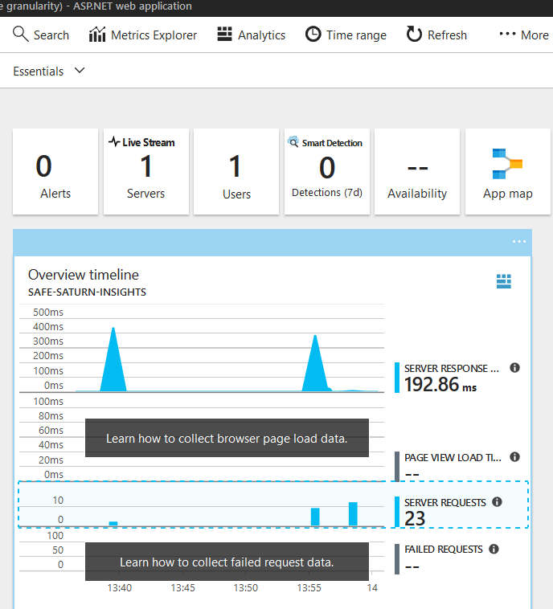
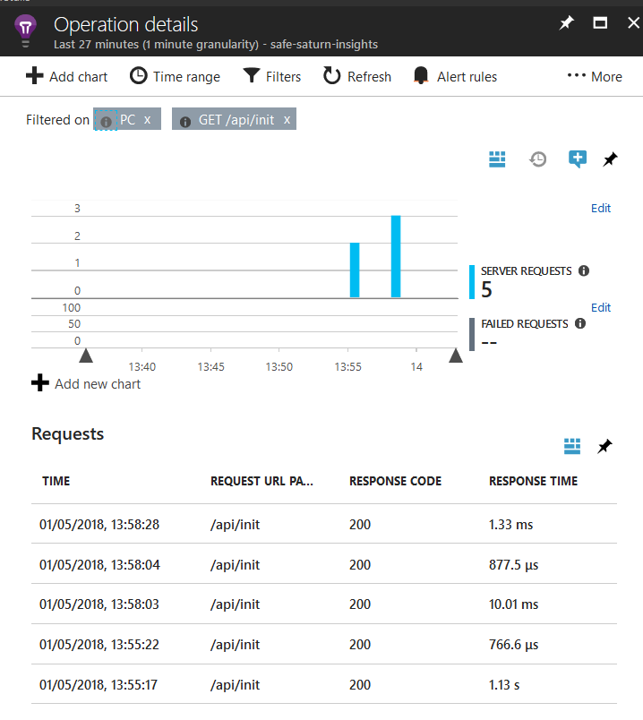

## What is Application Insights?

Application Insights (AI) is an extensible Application Performance Management (APM) service for web developers on multiple platforms. You can use it to monitor your live web application; it will automatically detect performance anomalies. It includes powerful analytics tools to help you diagnose issues and to understand what users actually do with your app. It's designed to help you continuously improve performance and usability. Features of AI include:

* **Request tracking**: monitoring every request, timing and response, with full correlation of operations within a request.
* **Dependency tracking**: understand calls to third-party dependencies e.g. databases, web services etc.
* **Failures**: Understand which failures are occurring on your site, how often and with full stack traces.
* **User behaviours**: Understand user flows such as funnels and retention.
* **Custom Events and Metrics**: You can easily create arbitrary metrics and events using the AI SDK for tracing and reporting.
* **Reporting Capabilities**: Either use AI's built-in query language to create reports, or automatically export all data into a Storage Account for offline analytics.

## Basics of working with AI

AI will automatically activate when you start running your SAFE application. You can locate your AI instance directly from within your SAFE Resource Group in the Azure Portal, or from the "Application Insights" link in the SAFE App Service.

From your AI dashboard, you can drill down to trace all server requests:

You can then drill into any specific request, such as the `api/init` route shown above, in order to see individual requests.

From here, you can even track further into any individual call. AI has many more features, so it's worth reading the [extensive documentation](https://docs.microsoft.com/en-us/azure/application-insights/) on the Azure website.

## How do SAFE apps integrate with AI?

Although AI supports monitoring for both client *and* server, at the current time, the SAFE template only supports the server mode (although you can add support for client events yourself). Server-side support includes:

* Support in the bundled ARM template to create a free AI instance along with your web application.
* Automatic configuration of your web application with connection details to the created AI instance.
* Application support for activating AI in code for e.g. custom events and metrics.

All server runtimes that are supported by the SAFE Template come with AI integration out of the box:

### AI support on Giraffe / Saturn
Giraffe uses the standard .NET Core Application Insights SDK in order to communicate with the AI service. It uses the standard AI middleware support for ASP .NET Core, which provides complete tracking of requests, dependencies, errors and live streaming.

### AI support on Suave
Suave also uses the standard .NET Core Application Insights SDK in order to communicate with the AI service. However, as Suave does not run on top of ASP .NET Core, it uses a custom web part to intercept and track all requests, dependencies and exceptions on the server as well as live streaming. This web part is typically attached at the "top level" of your web application, surrounding the global WebPart in order to track all requests.