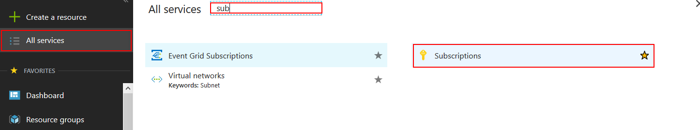

In order to deploy applications to Azure from the FAKE script created by the SAFE template, you first need to create an Azure account and create an App Registration which allows remote deployments as a one-off task. This section explains how to do this.

## Creating an Azure Account
You'll need to register for an Azure account. This can be achieved quickly and easily at [https://azure.microsoft.com](https://azure.microsoft.com). New users are afforded a number of services for free for an entire year, including Azure SQL, Storage and VMs etc.

## Selecting a Subscription
Once you have created your account, make a note of the Azure Subscription ID that you will deploy your SAFE applications into:

1. Log in to your [Azure Portal](https://portal.azure.com).
1. Select All Services on the left-menu menu and locate **Subscriptions** in the blade on the right.

1. Make a note of the **Subscription ID** of the subscription that you wish to deploy your application into. If you just created your Azure account, you'll most likely have a single subscription in the list.

## Creating an App Registration
You now need to create an "App Registration" in your Azure Active Directory. This registration allows you to deploy an entire environment directly into Azure, complete with the deployed application, directly from a FAKE script.

### Create the application
1. Navigate to the **Azure Active Directory** blade in the Portal.
1. Select **App registrations** from the menu in the blade.
1. Select **New registration**.

4. Enter the **Name** of your application as any name e.g **SAFE Deploy**
1. Set the **Redirect URI** as any URI e.g `http://safe-stack.github.io/`
1. Hit **Register**.

### Grant Permissions
There are two ways of authenticating; the first (which we show here) is to use an "impersonation" model where you are required to explicitly log in to Azure as part of the deployment process. An alternative way is to use a "Client Secret" (which should never be committed into source control) to deploy the application in a non-interactive fashion.

1. Choose **API Permissions** from the Manage group on the left menu.

2. Choose **Add a permission** from the top menu in the new blade that appears.

3. Choose **Azure Service Management** and hit **Select**.

4. Check the **user_impersonation** option and hit **Select**.

5. Hit **Add permissions** from the **Request API Permissions** blade.
1. Choose **Authentication** from the **Manage group** on the left menu.
1. Ensure that **Treat application as a public client** is set to **Yes**.

8. Hit **Save**.

### Copy configuration data

1. Click **Overview** on the left menu
1. Make a note of the **Application (client) ID** on the blade.
1. Make a note of the **Directory (tenant) ID** on the blade.

Congratulations - you're now ready to use the SAFE FAKE template to perform remote deployments.

Continue with [Deploy to App Service](template-appservice.md)