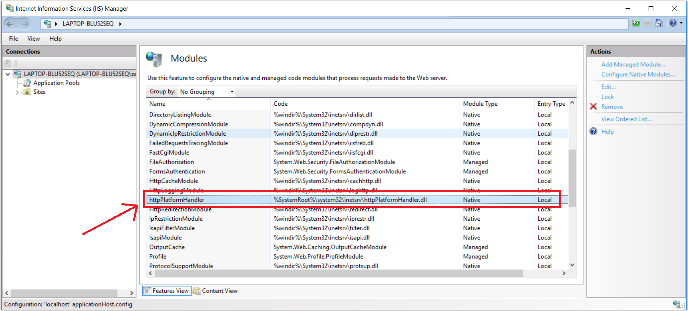
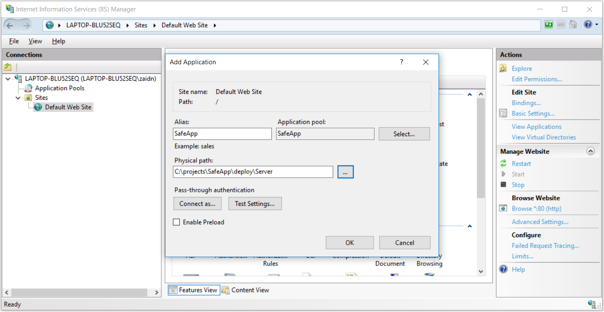
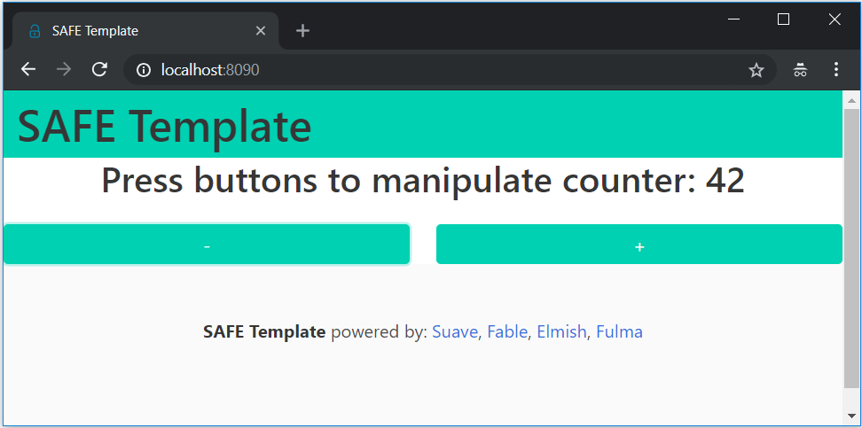

# Deploy to IIS 

The SAFE template can be easily deployed to [IIS](https://www.iis.net/), either on-premise or on a hosted virtual machine running Windows. To get started, scaffold the template with the deploy option set to IIS:

```bash
dotnet new SAFE --deploy iis
```

The template will include a custom FAKE build target called `Bundle` to package your application and make it ready for deployment, run this target using:

```
dotnet fake build --target bundle
```

When the target finishes running succesfully, you will have a new `deploy` directory with this structure:
```
{template root}
 |
 | - deploy
       | - Client
       | - Server 
``` 
Your app is now ready for deployment. 

# Setting up IIS 

### Create an Application Pool
Hosting dotnet core on IIS does not support Application Pool sharing which means every dotnet application has it's own application pool, create a new one, give it the name of the application, for example `SafeApp` and make sure to set the .NET CLR version to `No Managed Code`: 


### Required IIS Modules:
 - ASP.NET Core module for Giraffe and Saturn
 - HttpPlatformHandler for Suave

### ASP.NET Core module 
Like with any dotnet core app hosted within IIS, you will need to have the `AspNetCoreModule` installed in IIS<sup>*</sup>. This is a native module that starts your dotnet app in a child process of IIS and proxies all http requests coming from IIS to the application.


> Note that for netcoreapp2.2, you will need AspNetCoreModule and *not* AspNetCoreModuleV2.

### HttpPlatformHandler (applies to Suave)
Because Suave does not run on Kestrel, it does not use built-in IIS integration from ASP.NET Core, and therefore, Suave will use the generic [HttpPlatformHandler](https://www.iis.net/downloads/microsoft/httpplatformhandler) module in IIS. Make sure you have the module installed on your IIS server:



There is a catch when using Suave and HttpPlatformHandler: you cannot create sub-applications within an IIS *website* (root level application) because the virtual paths will break how the routing works in Suave, meaning that you have to add a new *website* for a Suave application. 

Another thing to considor when deploying Suave, is that you have to change a part your `web.config` manually, from this:
```xml
<httpPlatform 
      stdoutLogEnabled="true" 
      stdoutLogFile="suave.log" 
      startupTimeLimit="20" 
      processPath="dotnet" 
      arguments="./Server" />
``` 
to this:
```xml
<httpPlatform 
      stdoutLogEnabled="true" 
      stdoutLogFile="suave.log" 
      startupTimeLimit="20" 
      processPath="dotnet" 
      arguments="C:\full\path\to\deployed\Server.dll" />
```
because otherwise the HttpPlatformHandler will not be able to figure out where the application exactly is. 

### Add Application (applies to Giraffe and Saturn)
Now that the application pool is setup, we can our application to it. When Adding an application, you give it an ailias, and a physical path. In our case, because this is the only application in the application pool, lets just name it `SafeApp` and the physical path of the application is the *Server* directory of the bundled deployment directory:

```bash
{template root}
 |
 | - deploy
       | - Client
       | - Server <--- the physical path
```
Here I am adding the application to the default (root) website of IIS 

 

Now your application should be up and running!


### Add Website (applies to Suave)
Adding a website is the same as adding a sub-application, using a single application pool and having the physical path of the application be the *Server* directory of the bundled deployment directory:
```bash
{template root}
 |
 | - deploy
       | - Client
       | - Server <--- the physical path
```
but the difference is that now you have choose a different port for the application:


for this example, I have chosen to run the application on port `8090` and `web.config` looks like this:
```xml
<?xml version="1.0" encoding="utf-8"?>
<configuration>
  <system.webServer>
    <handlers>
      <remove name="httpplatformhandler" />
      <add name="httpplatformhandler" path="*" verb="*" modules="httpPlatformHandler" resourceType="Unspecified" />
    </handlers>
    <httpPlatform stdoutLogEnabled="true" stdoutLogFile="suave.log" startupTimeLimit="20" processPath="dotnet" arguments="C:\projects\SafeApp\deploy\Server\Server.dll" />
  </system.webServer>
</configuration>
```
Notice how I am using the full path of the compiled `Server.dll` from my deployment directory. 

Now click `OK` and your Suave app should be up and running:


 

### Deploying a new version 
 - Stop the application pool
 - Replace the contents of the deployment directory 
 - Restart/Recycle the application pool


### Client developement considorations (applies to Giraffe and Saturn)

When hosting inside IIS, your application will most likely run inside a virtual path like in the above example. This means that requests made using fetch will not work by default:
```fs
// will not work
fetchAs<Customer list> "/api/customers" 
```
To solve this, the template includes a module `ServerPath` with a function to normalize the routes, so instead of the above you would have:
```fs
// this works
fetchAs<Customer list> (ServerPath.normalize "/api/customers")
```
You will have to this for every request you make, unless you are using remoting which is done only once during proxy setup. 

Be careful not to forget `ServerPath.normalize`, because if you forget it during developement, the route still works because there is no IIS but then when you deploy the app, the route won't work any more because of the virtual paths.

